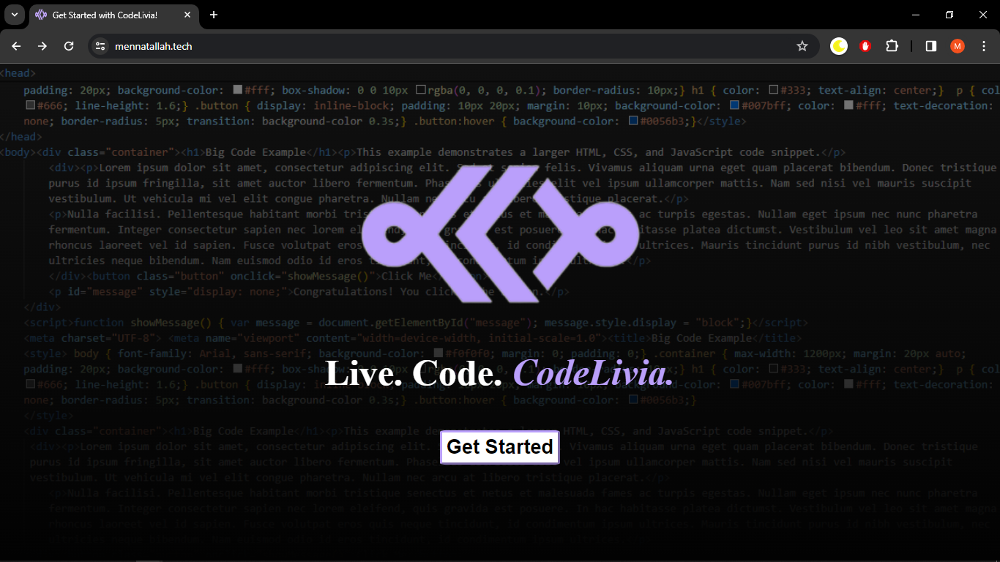

# CodeLivia

Codelivia is a web application that allows users to write HTML, CSS, and JavaScript code in separate panes and view the output in real-time in another pane. You can access the website [here](https://www.mennatallah.tech).

## Features

- **Code Editor Panes**: Separate panes for writing HTML, CSS, and JavaScript code.
- **Live Preview**: Real-time preview of the code output.
- **Syntax Highlighting**: Enhances code readability with syntax highlighting.
- **Auto-completion**: Saves the user time and enhances the experience.
- **Responsive Design**: Works seamlessly across various devices and screen sizes.

## Deployment

Codelivia has been deployed on two servers using Nginx for serving web content. A load balancer configured with HAProxy is used to distribute incoming traffic between these servers to ensure high availability and load balancing.

### Deployment Process

1. **GitHub Integration**: The project is hosted on GitHub, and changes pushed to the repository trigger automated deployment.
2. **Continuous Integration**: Jenkins is utilized for continuous integration. Whenever changes are made to the GitHub repository, Jenkins ensures that the updated code is built and deployed to the servers.
3. **Nginx Configuration**: Nginx is configured to serve the Codelivia web application on both servers.
4. **HAProxy Load Balancer**: HAProxy is set up to balance traffic between the deployed instances, ensuring even distribution and high availability.

## Usage

1. Clone the repository: `git clone https://github.com/MennatAllahhxx/CodeLivia.git`
2. Open `index.html` in your web browser.
3. Start coding in the HTML, CSS, and JavaScript panes.
4. View the live preview of your code output.

## Demo

Here is a demo code that was done on CodeLivia where it shows a the successful integration of the three input panes to present the output on one pane.

## Contributing

Contributions are welcome! If you'd like to contribute to Codelivia, please follow these steps:

1. Fork the repository.
2. Create a new branch: `git checkout -b feature/new-feature`
3. Make your changes and commit them: `git commit -am 'Add new feature'`
4. Push to the branch: `git push origin feature/new-feature`
5. Submit a pull request.

## Acknowledgements

- [Ace](https://ace.c9.io/) - for the excellent code editor component.
- [HAProxy](http://www.haproxy.org/) - for providing reliable load balancing.
- [Nginx](https://www.nginx.com/) - for serving web content efficiently.
- [Jenkins](https://www.jenkins.io/) - for continuous integration and deployment automation.

## Authors

- Mahmoud Salah - [Github](https://github.com/mahmoudsalah296)
- Menna Hassan - [Github](https://github.com/MennatAllahhxx) | [LinkedIn](https://www.linkedin.com/in/mennatallahhxx/)
 
## License

Public Domain. No copy write protection. 